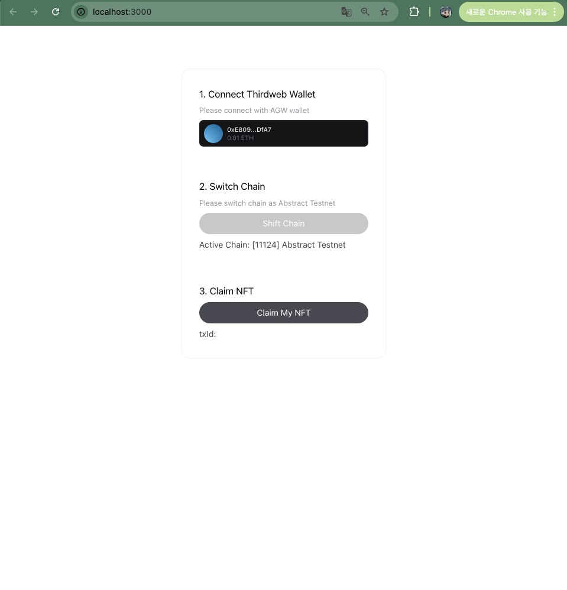
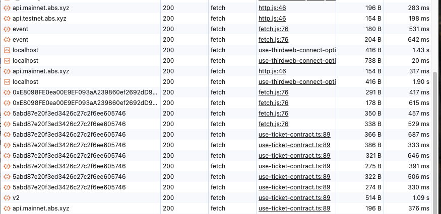

# Thirdweb-AGW-Testnet


[Demo](https://thirdweb-agw-abstract-testnet.vercel.app)

## Overview

> For verifying abstract testnet rpc is not working when using Thirdweb and AGW.

## How to reproduce the error. (in local)

- yarn version: v1.22.22
- node version: v22.12.0

### 1. Clone project and Install the packages

```bash
git clone https://github.com/howdyfrom2019/thirdweb-agw-abstract-testnet.git
cd [your-path]
yarn install # or npm install
```

### 2. Run development server

```bash
yarn dev # or npm run dev
```

### 3. Check in local

```bash
http://localhost:3000
```

## My result

I configure with abstract testent, but the origin url of rpc is `api.mainnet.abs.xyz`


